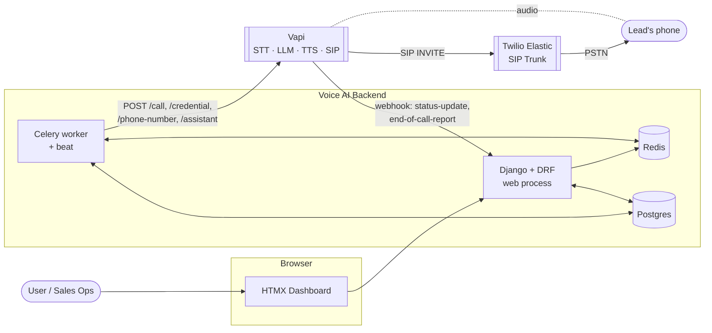
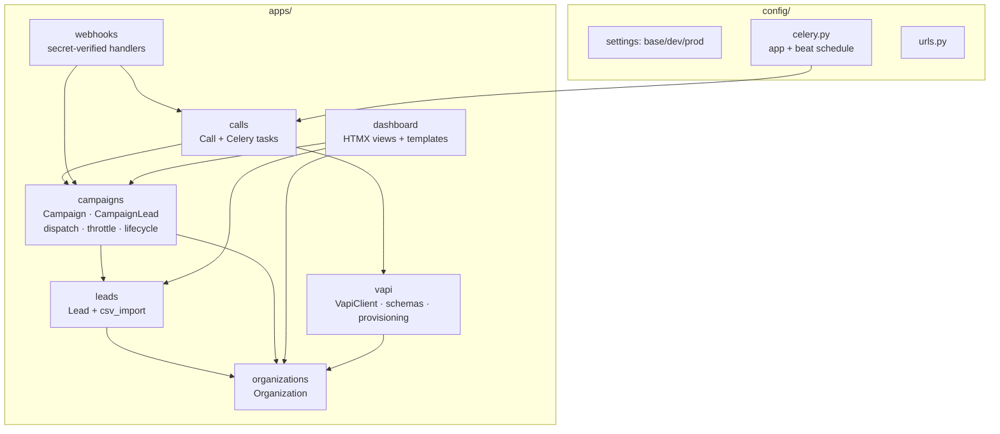
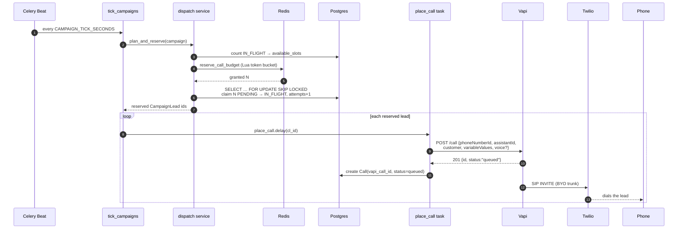
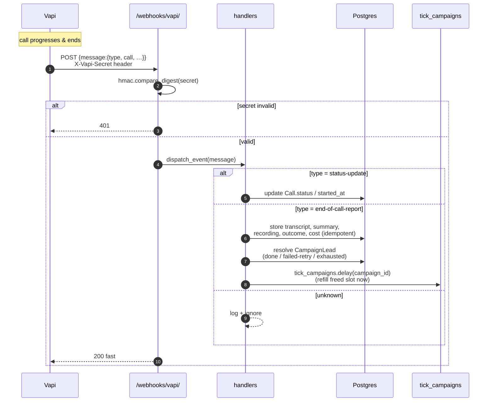
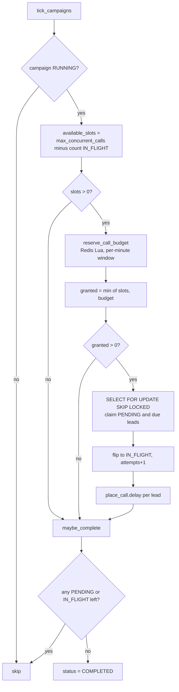
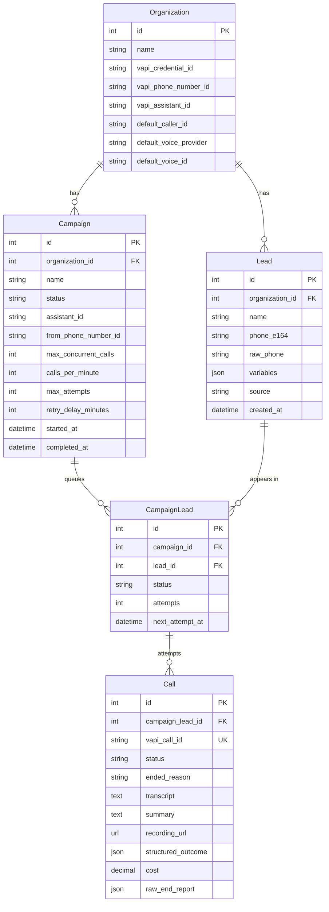
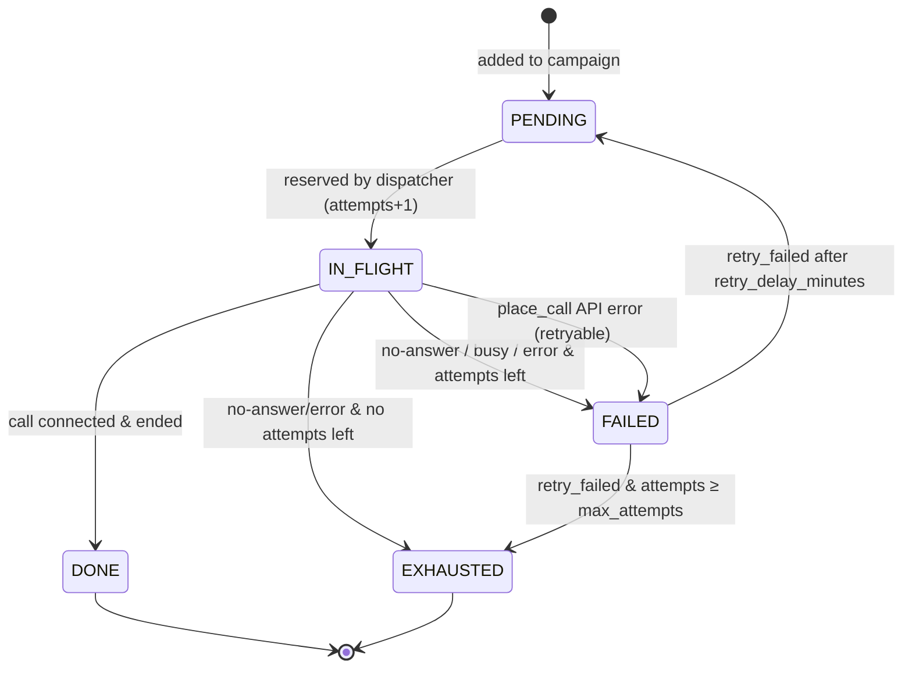
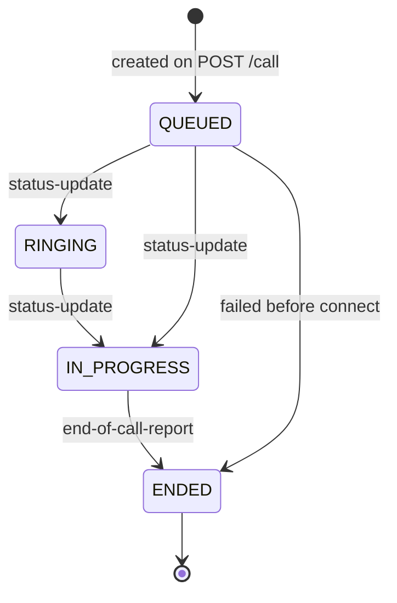
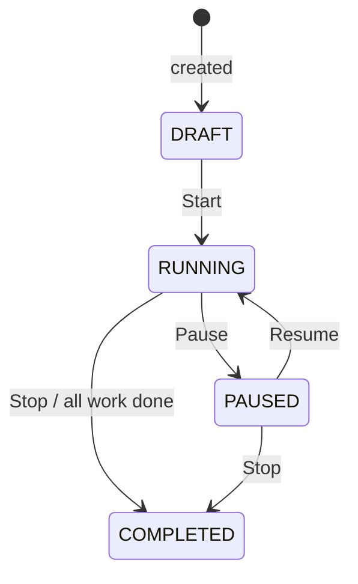
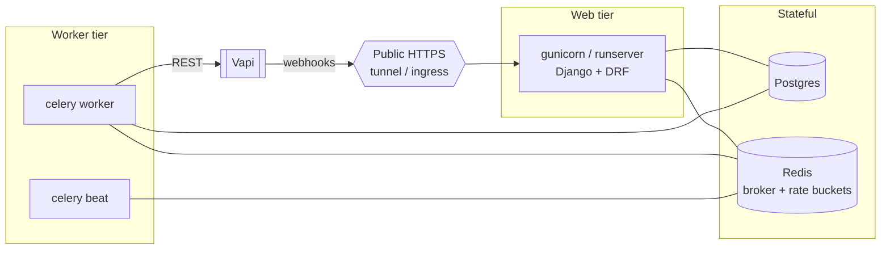

# Voice AI — Architecture

This document is the visual + structural map of the system. For setup and usage
see [`README.md`](./README.md); for implementation-level detail see
[`TECHNICAL_DETAILS.md`](./TECHNICAL_DETAILS.md).

> All diagrams are [Mermaid](https://mermaid.js.org/). They render natively on
> GitHub and in most Markdown viewers.

---

## 1. The core idea

**Vapi runs the voice conversation over your own Twilio Elastic SIP Trunk
(BYO-SIP). This Django backend never touches audio.** Its job is orchestration
and bookkeeping:

- decide **which** leads to call and **how fast** (dispatch + throttling),
- hand each call to Vapi over REST (`POST /call`),
- receive **webhooks** with status, transcript, recording and outcome,
- present everything in a login-gated dashboard and a REST API.

```
CSV / manual ─▶ Lead ─▶ Campaign(throttle) ─▶ Celery dispatch ─▶ Vapi POST /call ─▶ Twilio SIP ─▶ lead's phone
                                                    ▲                                     │
                                                    └──────── webhook (status / report) ──┘
```

---

## 2. System context



Two backend processes share Postgres and Redis:

| Process | Responsibility |
|---------|----------------|
| **Web** (`runserver` / gunicorn) | Dashboard, REST API, inbound Vapi webhooks |
| **Worker + beat** (Celery) | Dispatch loop, placing calls, retries |

---

## 3. Component / module map



Dependency direction is one-way and layered: `organizations` is the base,
everything that places or records calls depends on `vapi` and `campaigns`, and
`dashboard` / `webhooks` sit on top. The `vapi` app is the **only** place that
talks HTTP to Vapi.

---

## 4. Placing one call — sequence



If `POST /call` fails, the lead is released back to `FAILED` (retry scheduled)
or `EXHAUSTED` — the slot is never leaked.

---

## 5. Webhook / outcome — sequence



The webhook handler is **idempotent on `vapi_call_id`** (Vapi may redeliver) and
always returns `2xx` quickly so Vapi doesn't retry storm.

---

## 6. Dispatch & throttling logic



Two independent guards bound the call rate:

- **Concurrency** — derived from the DB (`IN_FLIGHT` count), never a counter.
- **Rate** — a Redis fixed-window token bucket per `campaign:{id}:rate:{minute}`.

A lead holds its slot from reservation until a webhook (or failed dispatch)
resolves it, so concurrency can never exceed the cap even with overlapping ticks.

---

## 7. Data model



Constraints: `unique(organization, phone_e164)` on Lead, `unique(campaign,
lead)` on CampaignLead, `unique(vapi_call_id)` on Call. Every model carries an
`Organization` FK so single-tenant MVP can become multi-tenant without a rewrite.

---

## 8. State machines

### CampaignLead — the dispatch work queue



### Call — mirrors the Vapi call, driven by webhooks



`QUEUED · RINGING · IN_PROGRESS` are the **active** statuses (occupy a slot).

### Campaign



---

## 9. Process & deployment topology



Redis is dual-purpose: **Celery broker/result backend** *and* the **rate-limit
token buckets**. Postgres is the single source of truth for call concurrency.

---

## 10. Directory map

```
voice-ai/
├── ARCHITECTURE.md          ← this file
├── README.md                ← setup + usage
├── TECHNICAL_DETAILS.md     ← implementation reference
├── manage.py
├── pyproject.toml           ← uv deps, pytest + ruff config
├── .env.example
├── config/
│   ├── settings/{base,dev,prod}.py
│   ├── celery.py            ← Celery app + beat schedule
│   ├── urls.py              ← admin · auth · /api · /webhooks · dashboard
│   ├── asgi.py / wsgi.py
├── apps/
│   ├── organizations/       ← Organization (Vapi ids, default voice)
│   ├── leads/               ← Lead, csv_import service, DRF api
│   ├── campaigns/           ← Campaign, CampaignLead
│   │   └── services/        ← dispatch · throttle · lifecycle
│   ├── calls/               ← Call model, Celery tasks (dispatch loop)
│   ├── vapi/                ← VapiClient, schemas, provisioning, command
│   ├── webhooks/            ← /webhooks/vapi/ + handlers
│   └── dashboard/           ← HTMX views, urls, templates, templatetags
├── templates/               ← base.html (sidebar shell) + registration/login
└── tests/                   ← pytest: csv, dispatch, vapi client, webhooks
```
